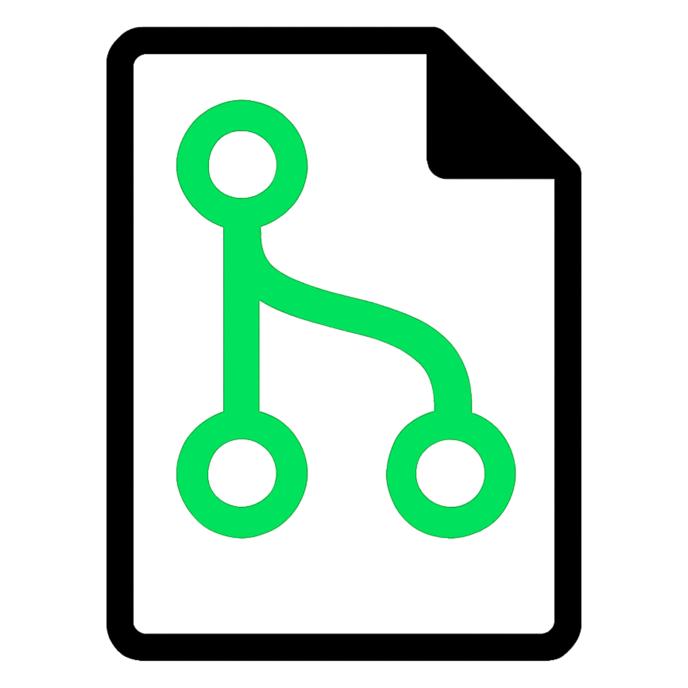

[![Contributors][contributors-shield]][contributors-url]
[![Forks][forks-shield]][forks-url]
[![Stargazers][stars-shield]][stars-url]
[![Issues][issues-shield]][issues-url]
[![MIT][license-shield]][license-url]
[![LinkedIn][linkedin-shield]][linkedin-url]

<!-- PROJECT LOGO -->
 

  

<h3 align="center">Grade</h3>

  

    Git remade in rust
     
    <a href="https://github.com/cmcmullen413/grade/issues/new?labels=bug&template=bug-report---.md">Report Bug</a>
    &middot;
    <a href="https://github.com/cmcmullen413/grade/issues/new?labels=enhancement&template=feature-request---.md">Request Feature</a>
  

<!-- TABLE OF CONTENTS -->

  
Table of Contents

  <ol>
    <li>
      <a href="#about-the-project">About The Project</a>
      <ul>
        <li><a href="#built-with">Built With</a></li>
      </ul>
    </li>
    <li>
      <a href="#getting-started">Getting Started</a>
      <ul>
        <li><a href="#prerequisites">Prerequisites</a></li>
        <li><a href="#installation">Installation</a></li>
      </ul>
    </li>
    <li><a href="#usage">Usage</a></li>
    <li><a href="#roadmap">Roadmap</a></li>
    <li><a href="#license">License</a></li>
    <li><a href="#contact">Contact</a></li>
  </ol>

<!-- ABOUT THE PROJECT -->
## About The Project

### TODO
[![Product Name Screen Shot][product-screenshot]](https://example.com)

Description

(<a href="#readme-top">back to top</a>)

### Built With

* [![Rust][Rust-Lang.org]][Rust-url]
* [![Python][Python.org]][Python-url]

(<a href="#readme-top">back to top</a>)

<!-- GETTING STARTED -->
## Getting Started

### TODO

### Prerequisites

### Installation

(<a href="#readme-top">back to top</a>)

<!-- USAGE EXAMPLES -->
## Usage

### TODO

(<a href="#readme-top">back to top</a>)

<!-- ROADMAP -->
## Roadmap

- [ ] Finish ReadMe
  - [ ] Project Icon and Name Art
  - [ ] Getting Started
  - [ ] Usage
  - [ ] Flesh Out Roadmap

See the [open issues](https://github.com/cmcmullen413/grade/issues) for a full list of proposed features (and known issues).

(<a href="#readme-top">back to top</a>)

<!-- LICENSE -->
## License

Distributed under the MIT. See `LICENSE.txt` for more information.

(<a href="#readme-top">back to top</a>)

<!-- CONTACT -->
## Contact

Caleb McMullen - cmcmullen413@gmail.com

Project Link: [https://github.com/cmcmullen413/grade](https://github.com/cmcmullen413/grade)

(<a href="#readme-top">back to top</a>)

<!-- MARKDOWN LINKS & IMAGES -->
<!-- https://www.markdownguide.org/basic-syntax/#reference-style-links -->
[contributors-shield]: https://img.shields.io/github/contributors/cmcmullen413/grade.svg?style=for-the-badge
[contributors-url]: https://github.com/cmcmullen413/grade/graphs/contributors
[forks-shield]: https://img.shields.io/github/forks/cmcmullen413/grade.svg?style=for-the-badge
[forks-url]: https://github.com/cmcmullen413/grade/network/members
[stars-shield]: https://img.shields.io/github/stars/cmcmullen413/grade.svg?style=for-the-badge
[stars-url]: https://github.com/cmcmullen413/grade/stargazers
[issues-shield]: https://img.shields.io/github/issues/cmcmullen413/grade.svg?style=for-the-badge
[issues-url]: https://github.com/cmcmullen413/grade/issues
[license-shield]: https://img.shields.io/github/license/cmcmullen413/grade.svg?style=for-the-badge
[license-url]: https://github.com/cmcmullen413/grade/blob/master/LICENSE.txt
[linkedin-shield]: https://img.shields.io/badge/-LinkedIn-black.svg?style=for-the-badge&logo=linkedin&colorB=555
[linkedin-url]: https://linkedin.com/in/caleb-mcmullen-102953265
[product-screenshot]: images/screenshot.png
<!-- Shields.io badges. You can a comprehensive list with many more badges at: https://github.com/inttter/md-badges -->
[Rust-Lang.org]: https://img.shields.io/badge/Rust-%23000000.svg?e&logo=rust&logoColor=white
[Rust-url]: https://rust-lang.org
[Python.org]: https://img.shields.io/badge/Python-3776AB?logo=python&logoColor=fff
[Python-url]: https://rust-python.org